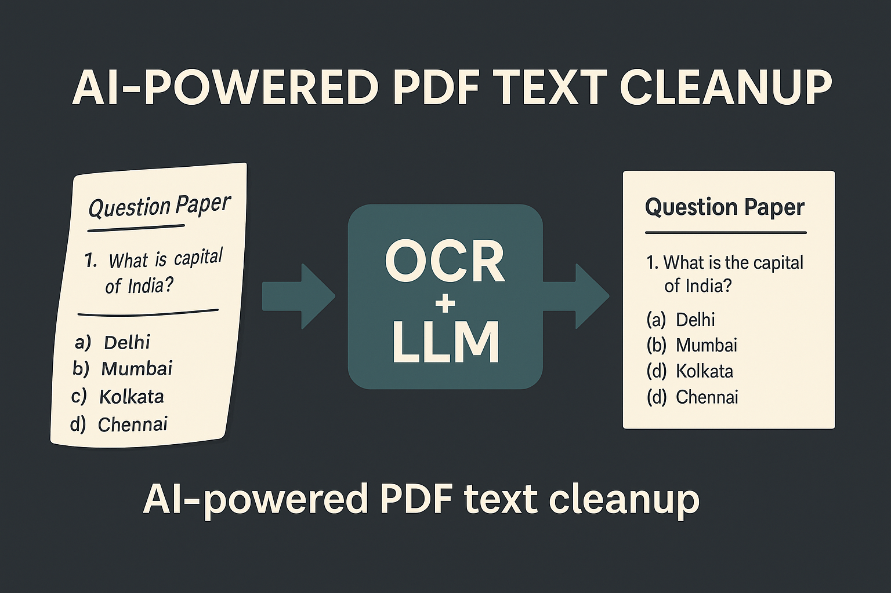
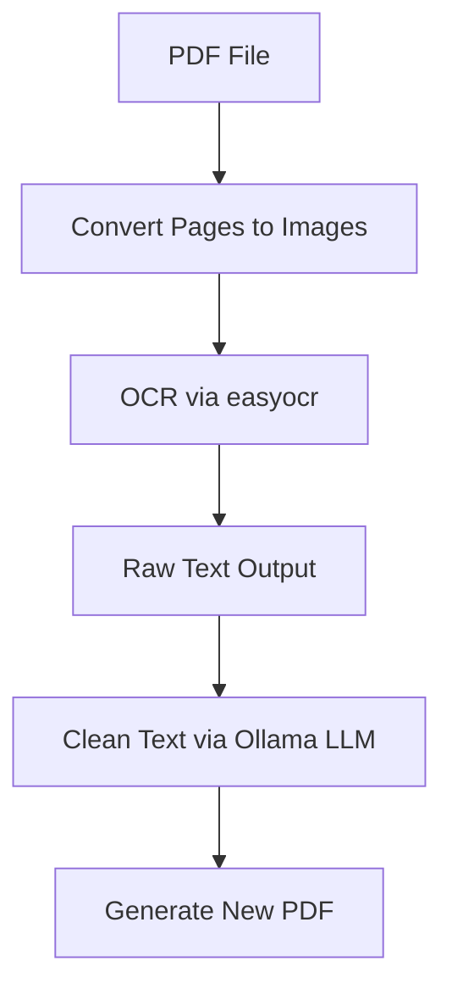
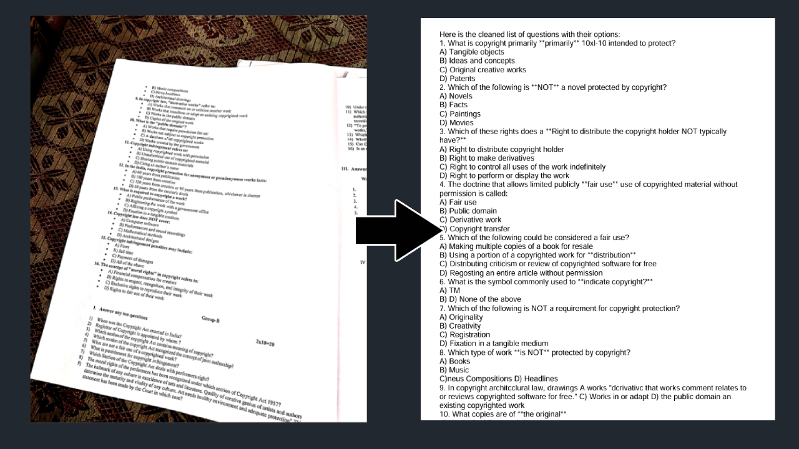

# 🧠 Ollama PDF Cleaner

> Convert cluttered, skewed, or noisy PDFs into clean, structured documents using OCR + LLM — fully offline.

 <!-- Replace this with your image path -->

---

## 🚀 What It Does

Ollama PDF Cleaner takes scanned PDFs (like exam papers, notes, or old books) and:

1. **Extracts images** from the PDF pages.
2. **Performs OCR** to read raw text from each image.
3. **Cleans up the text** using a local LLM (e.g. DeepSeek or LLaMA via Ollama).
4. **Exports** a clean, structured PDF ready for reuse or printing.

---

## 🧩 How It Works



### 🔁 Step-by-Step Flow

1. **PDF to Images**  
   Converts each page to high-resolution images using `pdf2image`.

2. **OCR (Optical Character Recognition)**  
   Text is extracted from the images using [easyocr](https://github.com/PaddlePaddle/easyocr), which is highly accurate for noisy/scanned content.

3. **Text Cleanup with LLM**  
   Raw OCR text is cleaned, de-duplicated, and structured using an LLM running locally via [Ollama](https://ollama.com). This improves readability and correctness.

4. **PDF Export**  
   The cleaned text is saved to a new PDF using `fpdf`.

---

## ⚙️ Underlying Tech Stack

| Layer          | Tool / Library                      | Purpose                            |
|----------------|-------------------------------------|------------------------------------|
| **OCR Engine** | [easyocr](https://github.com/JaidedAI/EasyOCR) | High-accuracy OCR for image text  |
| **LLM Engine** | [Ollama](https://ollama.com) + local model (e.g., DeepSeek) | Local AI-powered text postprocessing |
| **PDF Utils**  | `pdf2image`, `fpdf`                 | Image extraction and PDF export   |
| **Language**   | Python 3.9+                          | Main scripting                    |

---

## 📂 Project Structure

```
ollama-pdf-cleaner/
│
├── input/                # Put your input PDF(s) here
├── output/               # Cleaned PDF will be saved here
├── src/
│   ├── pdf_to_images.py
│   ├── ocr.py
│   ├── llm_postprocess.py
│   └── text_to_pdf.py
├── main.py               # Entry point
├── requirements.txt
└── README.md
```

---

## ✅ Requirements

### Python packages

Install all Python dependencies with:

```bash
pip install -r requirements.txt
```

Sample `requirements.txt`:
```
fpdf
pdf2image
easyocr
Pillow
requests
```

### Other Requirements

- **Poppler**: Required for `pdf2image`  
  On Ubuntu (WSL):  
  ```bash
  sudo apt install poppler-utils
  ```

- **Ollama** installed and running (on WSL or Windows)  
  Example model to use:
  ```bash
  ollama run deepseek
  ```

---

## 🏁 How to Run

1. Place your PDF file into the `input/` folder.
2. Start the Ollama model (`ollama run deepseek`).
3. Run the pipeline:

```bash
python main.py
```

4. Get the cleaned PDF from the `output/` folder.

---

## 📌 TODO (Optional Enhancements)

- [ ] UI/CLI for uploading PDFs
- [ ] Auto-detect and correct rotation/skew
- [ ] Support for multi-column layout
- [ ] Batch-processing support

---

## 🛡️ Privacy Note

This tool runs **entirely offline**. Your documents never leave your machine. Perfect for sensitive academic or legal documents.

---

## 🧠 Sample Output

📄 Before (Raw OCR Text):  
```
1 What is the capital of India?  
a Delhi b Mumbai c Kolkata d Chennai  
```

🧹 After LLM Cleanup:  
```
1. What is the capital of India?  
   (a) Delhi (b) Mumbai (c) Kolkata (d) Chennai
```

---

## 📸 Demo Screenshot

 <!-- Replace with your actual image -->

---

## 📖 License

MIT License. Use freely, improve freely.

---

## 🙌 Contribute

Got ideas? PRs are welcome. Just keep it clean, fast, and local.

> ⚠️ **Note**: The cleaned text is generated using an LLM and may not be 100% accurate. Please make sure to proofread the output before using it.
